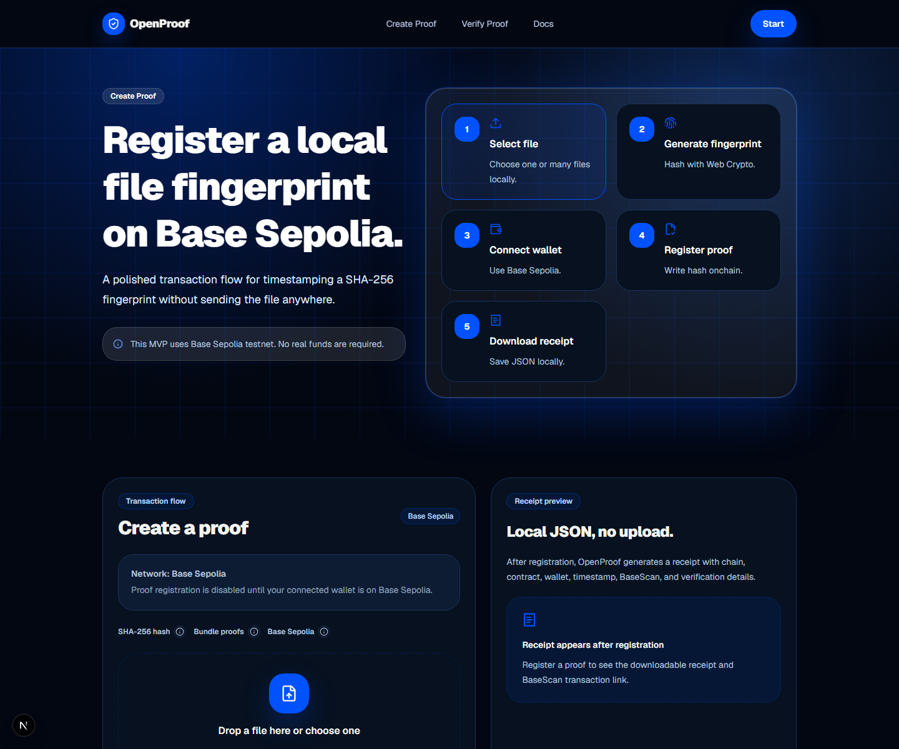
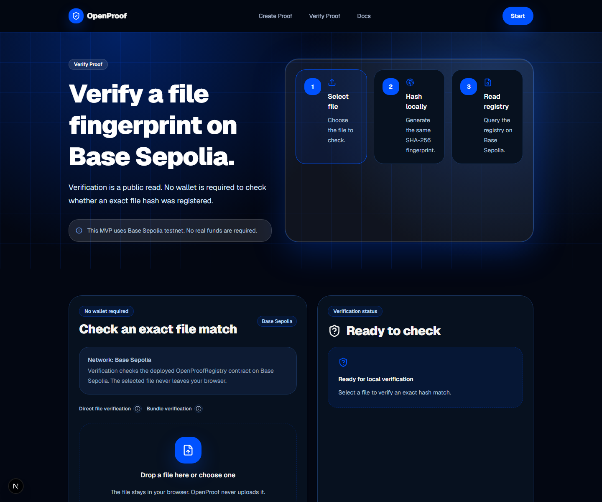

# OpenProof

OpenProof is a privacy-first, open-source proof-of-existence app for files, built on Base Sepolia.

**Maturity:** Prototype. Core workflows are functional but breaking changes are expected. See [docs/SYSTEMS_DOCTRINE.md](docs/SYSTEMS_DOCTRINE.md) and [rfcs/](rfcs/) for the governance and specification layer.

It lets users create timestamped blockchain proofs for file fingerprints without uploading or storing the files themselves. Files are hashed locally in the browser with SHA-256, and only the resulting `bytes32` hash is registered onchain through a minimal Solidity contract.

[](https://openproof.vercel.app)
[](https://github.com/sparshsam/openproof/actions/workflows/ci.yml)
[](LICENSE)
[](https://sepolia.basescan.org/address/0x60d3DD631E6e4F6D76f761689d6FA229945a874a)


## Quick Links

- [Live app](https://openproof.vercel.app)
- [BaseScan contract](https://sepolia.basescan.org/address/0x60d3DD631E6e4F6D76f761689d6FA229945a874a)
- [Architecture](docs/architecture.md)
- [Receipt specification](docs/spec/receipt-specification.md)
- [JSON Schema](docs/spec/openproof-receipt-schema.json)
- [Test vectors](docs/spec/openproof-test-vectors.md)
- [Threat model](docs/threat-model.md)
- [Security policy](SECURITY.md)
- [Contributing](CONTRIBUTING.md)
- [Changelog](CHANGELOG.md)

## What OpenProof Does

OpenProof creates a verifiable timestamp for a file hash:

1. Select a file in the browser.
2. OpenProof hashes the file locally using SHA-256.
3. Connect a wallet on Base Sepolia.
4. Register only the hash in `OpenProofRegistry`.
5. Download a local JSON receipt or share the proof page.
6. Verify later by hashing the exact same file again.

No file uploads. No server-side storage. No database. No IPFS dependency for the MVP.

## Screenshots

| Create proof | Verify proof |
| --- | --- |
|  |  |

Additional screenshots are available in [`public/screenshots`](public/screenshots).

## Features

| Feature | Status | Notes |
| --- | --- | --- |
| Local SHA-256 hashing | Available | Uses the browser Web Crypto API. File bytes stay local. |
| Proof registration | Available | Registers `bytes32` hashes on Base Sepolia. |
| Proof verification | Available | Re-hashes local files and checks the registry. |
| JSON proof receipts | Available | Generated and downloaded locally; never uploaded by OpenProof. |
| Receipt import | Available | Validates OpenProof receipt JSON and checks the hash onchain. |
| Local proof history | Available | Stored only in browser local storage. |
| Public proof pages | Available | `/proof/[hash]` reads public registry state. |
| QR verification | Available | Encodes the proof page URL, not the file. |
| Bundle proofs | Available | Deterministic combined hash for multiple local files. |
| Base mainnet | Roadmap | Current MVP is Base Sepolia testnet only. |

## Built on Base Sepolia

OpenProof v0 uses Base Sepolia so contributors and users can test the proof flow without real funds.

- Chain: Base Sepolia
- Chain ID: `84532`
- Explorer: [BaseScan Sepolia](https://sepolia.basescan.org)
- Registry contract: [`0x60d3DD631E6e4F6D76f761689d6FA229945a874a`](https://sepolia.basescan.org/address/0x60d3DD631E6e4F6D76f761689d6FA229945a874a)

The current public app is a testnet proof-of-existence utility. Base mainnet deployment is a roadmap item, not a current production claim.

## Privacy Model

OpenProof is designed around local-first proof creation:

- Files are read through the browser File API.
- Hashing happens locally with the Web Crypto API.
- Only the SHA-256 hash is sent to the smart contract.
- Receipts are local JSON downloads.
- Recent proof history stays in browser local storage.
- There is no backend upload endpoint, database, storage bucket, or account system.

Important caveat: public hashes can leak information if the original file is already known, small, or easy to guess. Do not register hashes for sensitive guessable content without understanding that risk.

## Security Notes

OpenProof proves that a matching hash was registered by a wallet at a recorded chain timestamp. It does not prove authorship, ownership, lawful possession, legal validity, or the truth of a file's contents.

If the original file is lost, OpenProof cannot recover it. The chain stores only the hash.

Do not use OpenProof for legal, financial, medical, compliance, or regulated claims without professional advice. See [`docs/threat-model.md`](docs/threat-model.md) and [`SECURITY.md`](SECURITY.md).

## Install and Run

Requirements:

- Node.js 22 or newer
- npm
- A WalletConnect project ID from Reown Cloud
- Base Sepolia test ETH for contract deployment or proof registration

```bash
git clone https://github.com/sparshsam/openproof.git
cd openproof
npm install
cp .env.example .env.local
npm run dev
```

Open `http://localhost:3000`.

Fill these values in `.env.local`:

```bash
NEXT_PUBLIC_WALLETCONNECT_PROJECT_ID=
NEXT_PUBLIC_CHAIN_ID=84532
NEXT_PUBLIC_OPENPROOF_CONTRACT_ADDRESS=0x60d3DD631E6e4F6D76f761689d6FA229945a874a
BASE_SEPOLIA_RPC_URL=https://sepolia.base.org
DEPLOYER_PRIVATE_KEY=
```

Never commit private keys. `.env` and `.env.local` are ignored by git.

## Build From Source

```bash
npm run lint
npm run typecheck
npm run build
npm run test:contracts
```

## Tech Stack

- Next.js 15
- TypeScript
- Tailwind CSS
- wagmi, viem, RainbowKit
- Solidity and Hardhat
- Base Sepolia
- Vercel

Contract commands:

```bash
npm run compile
npm run test:contracts
npm run deploy:base-sepolia
```

Deployment requires `BASE_SEPOLIA_RPC_URL` and `DEPLOYER_PRIVATE_KEY` in `.env`.

## Deploy to Vercel

OpenProof deploys as a static Next.js app with no backend services required.

1. Fork or clone this repository.
2. Import it into Vercel.
3. Add the public environment variables:
   - `NEXT_PUBLIC_WALLETCONNECT_PROJECT_ID`
   - `NEXT_PUBLIC_CHAIN_ID=84532`
   - `NEXT_PUBLIC_OPENPROOF_CONTRACT_ADDRESS`
4. Deploy with the default Next.js settings.

No paid domain, database, storage bucket, file uploads, or IPFS pinning service is required for the MVP.

## Project Structure

```text
contracts/                  Solidity registry contract
docs/                       Architecture, threat model, deployment notes
docs/spec/                  Canonical receipt specification, JSON Schema, test vectors
public/screenshots/         App screenshots used by docs and social previews
scripts/                    Contract deployment script
src/app/                    Next.js App Router pages
src/components/             Reusable UI and wallet components
src/lib/                    Hashing, receipts, contracts, history, proof utilities
test/                       Hardhat contract tests
```

## Roadmap

OpenProof should remain a small, trustworthy proof utility first. The roadmap expands the proof layer without turning the app into a storage product, marketplace, token system, or legal-tech overclaim.

### Near-Term

- **Detached signature support** — let users sign a file hash or receipt with a wallet without necessarily registering a new proof onchain.
- **~~Stronger receipt format~~** ✅ *Delivered in v0.2* — versioned, canonical JSON receipts with deterministic serialization, Ed25519 signatures, and portable verification. See [`docs/spec/receipt-specification.md`](docs/spec/receipt-specification.md).
- **Receipt verification polish** — clearer success, mismatch, unsupported-chain, and malformed-receipt states.
- **~~Better bundle proofs~~** ✅ *Delivered in v0.2* — canonical bundle receipt type with sorted commitments array, deterministically-derived subject hash, and inclusion verification. See [Bundle Proofs §7](docs/spec/receipt-specification.md#7-bundle-proofs).
- **Self-hosting documentation** — clearer deployment notes for Vercel, static hosting, custom RPCs, and self-deployed contracts.
- **Threat-model expansion** — document hash-guessing risks, known-file attacks, metadata leakage, wallet privacy, and timestamp limitations in more accessible language.

### Mid-Term

- **Base mainnet deployment** — production registry deployment on Base mainnet after testnet UX and contract assumptions are stable.
- **Reproducible deployment metadata** — publish compiler version, source verification notes, deployment scripts, and deterministic contract metadata.
- **Event indexing options** — provide lightweight indexing paths for larger deployments without making a backend mandatory for the core app.
- **Proof collections** — allow users to group related proofs locally, such as a project folder, evidence bundle, release archive, or creative work package.
- **Portable proof pages** — static, shareable proof pages that can be saved or mirrored without depending on OpenProof hosting forever.
- **Multilingual documentation** — translate core usage, privacy, and risk explanations for broader accessibility.

### Long-Term Vision

- **~~Open proof standard~~** ✅ *Initial specification delivered* — the [canonical receipt specification](docs/spec/receipt-specification.md) defines the interoperable proof receipt format. Cross-app adoption and implementation guides are the next layer.
- **Cross-app verification layer** — let tools like local PDF readers, research notebooks, archives, and creator tools anchor proofs through the same receipt model.
- **Organization and project attestations** — optional signing flows for teams, open-source maintainers, journalists, researchers, and creators to prove who anchored a file hash.
- **Proof timelines** — build local timelines showing how a document, folder, release, or bundle changed over time through successive hashes.
- **Public-interest archives** — support verifiable public datasets, civic documents, open research artifacts, and community records without requiring OpenProof to host the underlying files.
- **Offline-first verifier** — a downloadable verifier that can validate receipts and re-hash files without using the hosted web app.

### What OpenProof Will Not Become

- No file hosting platform.
- No NFT marketplace.
- No token, rewards, staking, or DeFi layer.
- No claim that a hash proves authorship, ownership, truth, legality, or copyright.
- No mandatory backend, account system, analytics, or file upload pipeline.

OpenProof uses Base as calm verification infrastructure: public enough to be durable, minimal enough to stay out of the user's way.

## Future Philosophy

OpenProof is part of a broader direction: software that helps people prove things without surrendering the thing itself.

The long-term ecosystem idea is:

- **Proof before platform** — let users verify existence and integrity without depending on a company database.
- **Privacy before convenience theatre** — never upload files just to make verification feel magical.
- **Local-first by default** — hash, inspect, and verify as much as possible on the user's own device.
- **Permanence without exposure** — use public infrastructure for small fingerprints, not private contents.
- **Interoperable calm tools** — receipts, hashes, and verification flows should work across projects instead of becoming another silo.
- **Base as infrastructure, not speculation** — low-cost public settlement for proofs, not a reason to invent a token.

The immediate goal is simple: create and verify trustworthy file fingerprints. The ambitious goal is an open proof layer that other quiet, privacy-minded tools can rely on.

## Contributing

Contributions are welcome when they preserve the core architecture: local hashing, no file uploads, no mandatory backend, and no speculative token or DeFi features.

Before opening a pull request:

```bash
npm run lint
npm run typecheck
npm run build
npm run test:contracts
```

For UI changes, include screenshots. For security-sensitive changes, update the threat model or security policy where relevant. See [`CONTRIBUTING.md`](CONTRIBUTING.md).

## Repository Metadata

Recommended GitHub topics:

```text
base, base-sepolia, built-on-base, onchain, proof-of-existence, ethereum,
solidity, viem, wagmi, rainbowkit, web3, cryptography, privacy-first,
nextjs, typescript, tailwindcss, vercel, agplv3
```

## License

OpenProof is licensed under AGPL-3.0-only. See [`LICENSE`](LICENSE).
