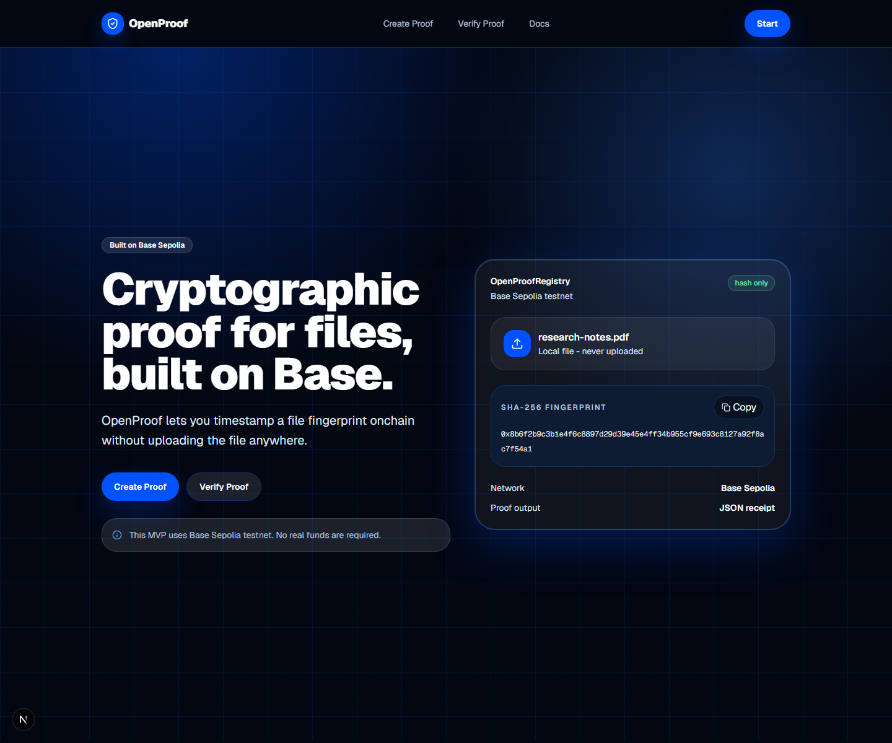

  <picture><source media="(prefers-color-scheme: dark)" srcset="assets/branding/icon.svg"></picture>
  <h1>OpenProof</h1>
  
<strong>Privacy-first proof-of-existence for files.</strong> Timestamp file fingerprints on Base Sepolia without uploading a single byte.

## Hero

## Gallery

| Create proof | Verify proof |
|---|---|
|  |  |

## Why OpenProof

OpenProof creates verifiable timestamps for file hashes. No uploads. No accounts. No database. Select a file, hash it locally with SHA-256, register only the hash on Base Sepolia, and download a portable JSON receipt. Verify later by hashing the exact same file again — no original file ever leaves your device.

## Features

| Feature | Description |
|---|---|
| **Local SHA-256 hashing** | Files are hashed in-browser via the Web Crypto API. File bytes stay local. |
| **Proof registration** | Register `bytes32` hashes on the Base Sepolia blockchain. |
| **Proof verification** | Re-hash local files and check against the onchain registry. |
| **JSON receipts** | Portable, versioned proof receipts downloaded locally. |
| **Receipt import** | Validate existing receipts and verify hashes onchain. |
| **Local proof history** | Recent proofs stored in browser local storage only. |
| **Public proof pages** | `/proof/[hash]` reads public registry state for sharing. |
| **QR verification** | QR-encode the proof page URL for quick mobile verification. |
| **Bundle proofs** | Deterministic combined hash for multiple local files. |

## Designed For

- **Researchers** — timestamp research data and preprints.
- **Creators** — prove ownership of digital works without uploading.
- **Archivists** — anchor file fingerprints to an immutable chain.
- **Anyone** — who needs to prove a file existed at a certain time.

## Design Philosophy

> "Proof before platform — let users verify existence without surrendering the file itself."

OpenProof is part of a broader direction: software that helps people prove things without surrendering the thing itself. Local-first by default. Privacy before convenience theatre. Permanence without exposure.

## Built With

- [Next.js 16](https://nextjs.org/)
- [TypeScript](https://www.typescriptlang.org/)
- [Tailwind CSS](https://tailwindcss.com/)
- [wagmi](https://wagmi.sh/) / [viem](https://viem.sh/) / [RainbowKit](https://www.rainbowkit.com/)
- [Solidity](https://soliditylang.org/) / [Hardhat](https://hardhat.org/)
- [Base Sepolia](https://base.org/)
- [Vercel](https://vercel.com/)

## Version Journey

| Version | Date | Highlights |
|---|---|---|
| v0.4.0 | 2026-06 | Receipt specification — canonical JSON receipt format with deterministic serialization |
| v0.3.0 | 2026-05 | Bundle proofs — combined hash for multiple files with sorted commitments |
| v0.2.0 | 2026-04 | QR verification — encode proof page URL for mobile verification |
| v0.1.0 | 2026-03 | MVP — basic proof creation, verification, and local history |

## Quick Links

- [Live app](https://proof.kovina.org)
- [BaseScan contract](https://sepolia.basescan.org/address/0x60d3DD631E6e4F6D76f761689d6FA229945a874a)
- [Development setup](docs/Development.md)
- [Architecture](docs/Architecture.md)
- [Deployment](docs/Deployment.md)
- [Testing](docs/Testing.md)
- [Contributing](CONTRIBUTING.md)
- [Receipt specification](docs/spec/receipt-specification.md)
- [Threat model](docs/threat-model.md)
- [Privacy policy](docs/PRIVACY.md)
- [Terms of service](docs/TERMS.md)
- [Changelog](CHANGELOG.md)

## License

AGPL-3.0-only. See [`LICENSE`](LICENSE).

### Open Collection

| Project | Description |
|---|---|
| [OpenPalette](https://github.com/sparshsam/openpalette) | Accessibility-first color system |
| [OpenSend](https://github.com/sparshsam/opensend) | Encrypted file sharing |
| [OpenSprout](https://github.com/sparshsam/opensprout) | Lightweight project scaffold |
| [OpenTone](https://github.com/sparshsam/opentone) | Minimal audio tools |
| **OpenProof (you are here)** | Privacy-first proof-of-existence |

 

---

 

  <strong>Part of the Kovina Collection</strong>

  <a href="https://github.com/sparshsam/openreader">OpenReader</a> ·
  <a href="https://github.com/sparshsam/openjournal">OpenJournal</a> ·
  <a href="https://github.com/sparshsam/openledger">OpenLedger</a> ·
  <a href="https://github.com/sparshsam/opentone">OpenTone</a> ·
  <a href="https://github.com/sparshsam/openpalette">OpenPalette</a> ·
  <a href="https://github.com/sparshsam/openconvert">OpenConvert</a>

  <a href="https://github.com/sparshsam/opensnap">OpenSnap</a> ·
  <a href="https://github.com/sparshsam/worldclock-widget">WorldClock Widget</a> ·
  <a href="https://github.com/sparshsam/openproof">OpenProof</a> ·
  <a href="https://github.com/sparshsam/opensend">OpenSend</a> ·
  <a href="https://github.com/sparshsam/opensprout">OpenSprout</a>

  <a href="https://github.com/sparshsam/wordwise">WordWise</a> ·
  <a href="https://github.com/sparshsam/openscrabble">OpenScrabble</a> ·
  <a href="https://github.com/sparshsam/chess">Chess</a> ·
  <a href="https://github.com/sparshsam/hisstastic">Hisstastic</a>

  Minimal, focused tools for everyday tasks.

