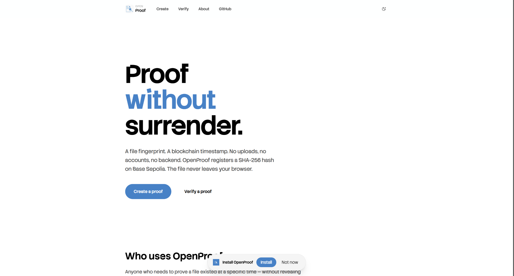
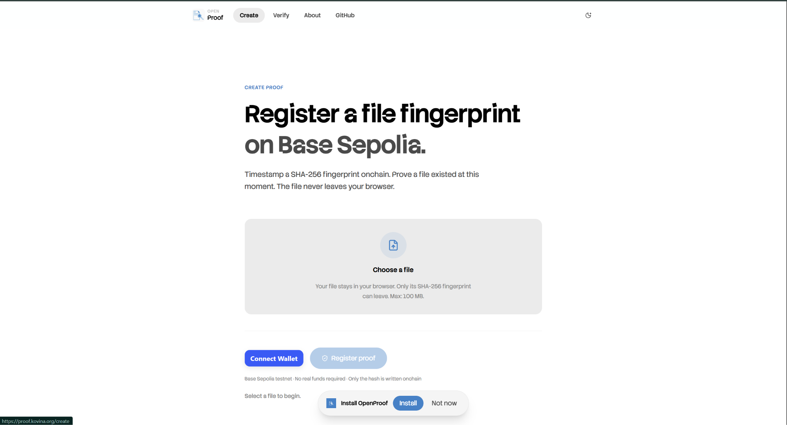
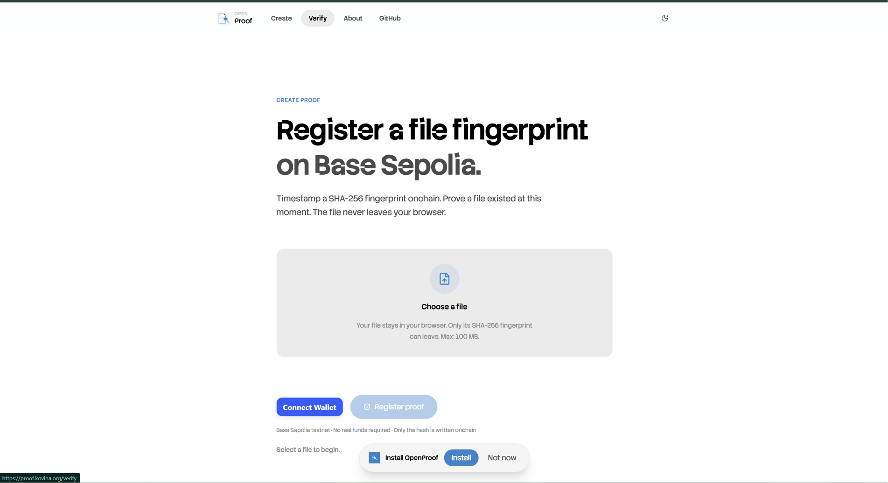

  

  <h1>OpenProof</h1>
  
<strong>Privacy-first proof-of-existence for files.</strong> Timestamp file fingerprints on Base Sepolia without uploading a single byte.

## Hero

## Gallery

| Create proof | Verify proof |
|---|---|
|  |  |

## Why OpenProof

OpenProof creates verifiable timestamps for file hashes. No uploads. No accounts. No database. Select a file, hash it locally with SHA-256, register only the hash on Base Sepolia, and download a portable JSON receipt. Verify later by hashing the exact same file again — no original file ever leaves your device.

## Features

| Feature | Description |
|---|---|
| **Local SHA-256 hashing** | Files are hashed in-browser via the Web Crypto API. File bytes stay local. |
| **Proof registration** | Register `bytes32` hashes on the Base Sepolia blockchain. |
| **Proof verification** | Re-hash local files and check against the onchain registry. |
| **JSON receipts** | Portable, versioned proof receipts downloaded locally. |
| **Receipt import** | Validate existing receipts and verify hashes onchain. |
| **Local proof history** | Recent proofs stored in browser local storage only. |
| **Public proof pages** | `/proof/[hash]` reads public registry state for sharing. |
| **QR verification** | QR-encode the proof page URL for quick mobile verification. |
| **Bundle proofs** | Deterministic combined hash for multiple local files. |

## Designed For

- **Researchers** — timestamp research data and preprints.
- **Creators** — prove ownership of digital works without uploading.
- **Archivists** — anchor file fingerprints to an immutable chain.
- **Anyone** — who needs to prove a file existed at a certain time.

## Design Philosophy

> "Proof before platform — let users verify existence without surrendering the file itself."

OpenProof is part of a broader direction: software that helps people prove things without surrendering the thing itself. Local-first by default. Privacy before convenience theatre. Permanence without exposure.

## Built With

- [Next.js 16](https://nextjs.org/)
- [TypeScript](https://www.typescriptlang.org/)
- [Tailwind CSS](https://tailwindcss.com/)
- [wagmi](https://wagmi.sh/) / [viem](https://viem.sh/) / [RainbowKit](https://www.rainbowkit.com/)
- [Solidity](https://soliditylang.org/) / [Hardhat](https://hardhat.org/)
- [Base Sepolia](https://base.org/)
- [Vercel](https://vercel.com/)

## Version Journey

| Version | Date | Highlights |
|---|---|---|
| v0.1.0 | 2026-05-29 | MVP — local SHA-256 hashing, Base Sepolia proof registration, JSON receipts, bundle proofs, QR verification, proof explorer |
| v0.1.1 | 2026-06-22 | PWA support (manifest, service worker, app icons), cross-platform icon set, store metadata, release checklist |
| v0.1.2 | 2026-06-22 | Light/dark theme toggle, native About / Privacy / Terms pages, Block/Cash App UI revamp |
| v0.1.4 | 2026-06-23 | Trust & Transparency — About page redesign, architecture diagram, threat model, registry transparency |
| v0.2.0 | 2026-06-25 | Cryptographic Foundation — receipt schema v3, registry abstraction layer, wallet state handling |
| v0.3.0 | 2026-06-25 | Merkle tree bundle proofs, bundle explorer (`/bundle/[hash]`), bundle storage |
| v0.4.0 | 2026-06-25 | Professional evidence workflows — timezone support, citation formats (APA/MLA/Legal), human-readable receipt view + print/PDF, QR improvements |
| v0.5.0 | 2026-06-25 | Verification engine — full receipt validation pipeline (11+ checks), `VerificationReport` |
| v0.6.0 | 2026-06-25 | Long-term preservation — archive package export, hash algorithm abstraction, compatibility checks |
| v0.7.0 | 2026-06-25 | Explorer improvements — bundle awareness on proof pages, canonical URLs, chain-aware explorer |
| v0.8.0 | 2026-06-25 | Release Hardening — error boundary, offline detection, CSP security headers, store readiness |
| v0.9.0 | 2026-06-25 | Native Platform Readiness — MSIX packaging, Android (Capacitor), PWA polish, domain migration |
| v0.9.1 | 2026-07-02 | Open Product Family branding — lockup alignment, Kovina Collection footer, dual-theme icon overhaul |
| v0.9.2 | 2026-07-04 | GeneratedAssets replacement, Kovina footer, PWA icon refresh, README overhaul |
| v0.9.3 | 2026-07-04 | Installed PWA App Experience — `/app` workbench, splash screen, bottom nav, compact header, display-mode detection |
| v0.9.4 | 2026-07-05 | PWA Shell Polish & Tab Restructure — desktop shell, header nav, landing page, wallet fix, hydrate guard |
| v0.9.5 | 2026-07-05 | Release Candidate — accessibility, PWA hardening, codebase cleanup, dependency audit |
| v0.9.6 | 2026-07-05 | Release Freeze — zero lint errors, zero TS errors, zero build warnings, lock audit |
| **v1.0.0** | **2026-07-05** | **Stable Release — first stable version of privacy-first proof-of-existence on Base Sepolia** |

## Quick Links

- [Live app](https://proof.kovina.org)
- [BaseScan contract](https://sepolia.basescan.org/address/0x60d3DD631E6e4F6D76f761689d6FA229945a874a)
- [Development setup](docs/Development.md)
- [Architecture](docs/Architecture.md)
- [Deployment](docs/Deployment.md)
- [Testing](docs/Testing.md)
- [Contributing](CONTRIBUTING.md)
- [Receipt specification](docs/spec/receipt-specification.md)
- [Threat model](docs/threat-model.md)
- [Privacy policy](docs/PRIVACY.md)
- [Terms of service](docs/TERMS.md)
- [Changelog](CHANGELOG.md)

## License

AGPL-3.0-only. See [`LICENSE`](LICENSE).

---

  <strong>Part of the Kovina Collection</strong>

  <a href="https://github.com/sparshsam/openreader">OpenReader</a> ·
  <a href="https://github.com/sparshsam/openjournal">OpenJournal</a> ·
  <a href="https://github.com/sparshsam/openledger">OpenLedger</a> ·
  <a href="https://github.com/sparshsam/opentone">OpenTone</a> ·
  <a href="https://github.com/sparshsam/openpalette">OpenPalette</a> ·
  <a href="https://github.com/sparshsam/openconvert">OpenConvert</a>

  <a href="https://github.com/sparshsam/opensnap">OpenSnap</a> ·
  <a href="https://github.com/sparshsam/worldclock-widget">WorldClock Widget</a> ·
  <a href="https://github.com/sparshsam/openproof">OpenProof</a> ·
  <a href="https://github.com/sparshsam/opensend">OpenSend</a> ·
  <a href="https://github.com/sparshsam/opensprout">OpenSprout</a>

  <a href="https://github.com/sparshsam/wordwise">WordWise</a> ·
  <a href="https://github.com/sparshsam/openscrabble">OpenScrabble</a> ·
  <a href="https://github.com/sparshsam/chess">Chess</a> ·
  <a href="https://github.com/sparshsam/hisstastic">Hisstastic</a>

  Minimal, focused tools for everyday tasks.

