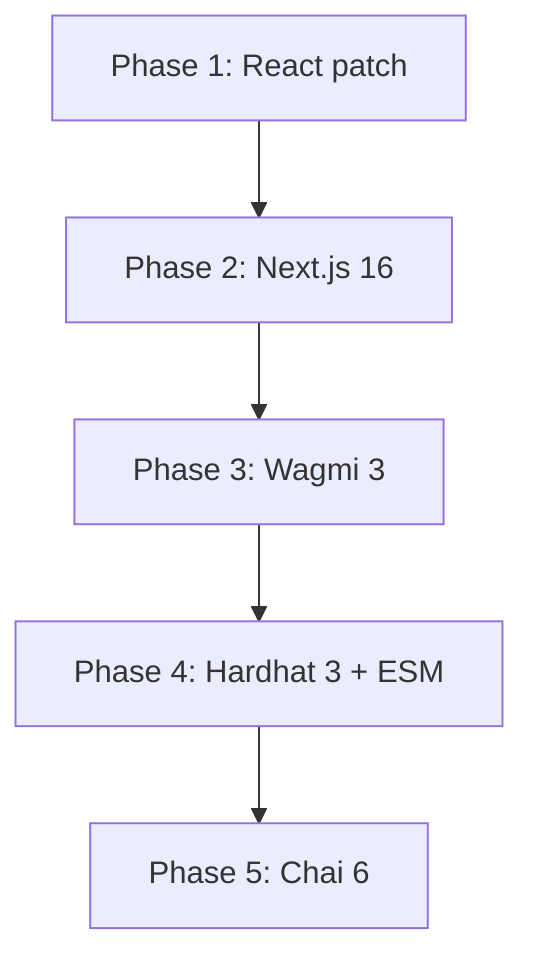

# OpenProof — Major Dependency Migration Plan

**Status:** Planning  
**Last Updated:** 2026-06-05  
**Owner:** Sparsh Sam  

> This document is a plan only. Do not implement migrations listed here until Sparsh has reviewed and approved the approach.

---

## 1. Current Open Dependabot PR Inventory

| # | PR | Dependency | From | To | Type | Risk | Blocker |
|---|-----|-----------|------|----|------|------|---------|
| 1 | #8 | react-dom | 19.2.4 | 19.2.7 | patch | low | Must be grouped with react@19.2.4→19.2.7 (peer dep: react-dom 19.2.7 requires react ^19.2.7) |
| 2 | #3 | next + eslint-config-next | 15.5.18 | 16.2.7 | major | medium-high | Build pipeline — `next.config.ts` ESM loading fails under Next.js 16 |
| 3 | #9 | wagmi + viem + @tanstack/react-query | 2.19.5 → 3.6.16, 2.51.0 → 2.52.2, 5.100 → 5.101 | mixed (wagmi major) | high | Wagmi v3 has breaking API changes in provider architecture, connector setup, and hook signatures |
| 4 | #5 | hardhat + hardhat-toolbox | 2.28.6 → 3.8.0, 5.0.0 → 7.0.0 | major | high | Hardhat 3 requires ESM (`"type": "module"`), affecting entire project module system |
| 5 | #6 | chai | 4.5.0 | 6.2.2 | major | medium | Blocked by hardhat-chai-matchers peer dep on chai ^4; must follow hardhat-toolbox upgrade |

---

## 2. Migration Risk Matrix

| Dependency | Risk Level | Breaking Changes | Affected Areas | Rollback Complexity |
|-----------|-----------|-----------------|---------------|-------------------|
| React (patch) | **Low** | None — patch-level within same major | package.json, lockfile | Trivial — revert version |
| Next.js 16 | **Medium-High** | ESM config loading, removed deprecated APIs, changes to data fetching, middleware, and image optimization defaults | `next.config.ts`, build pipeline, possibly page/layout components | Medium — config change may need manual revert |
| Wagmi 3 | **High** | New provider API (`createConfig` → `createWagmiConfig`), connector API changes, hook signature changes, RainbowKit integration changes | `wallet-provider.tsx`, `contracts.ts`, `create/page.tsx`, `proof-explorer-client.tsx`, `verify/page.tsx` | High — code changes throughout wallet integration layer |
| Hardhat 3 | **High** | Requires `"type": "module"` in package.json, CJS config files break, `hardhat.config.js` must become ESM, deploy scripts need `import` instead of `require` | `package.json`, `hardhat.config.js`, `scripts/deploy.js`, `test/OpenProofRegistry.js`, CI pipeline | High — module system change affects all tooling |
| Chai 6 | **Medium** | Breaking API changes (removed `.to.be.revertedWith` patterns, changed assertion APIs) | `test/OpenProofRegistry.js` (all chai `expect` calls) | Low — only test files affected |

### Combined Risk: Hardhat 3 + Chai 6

These two are tightly coupled — Hardhat 3 + hardhat-toolbox v7 may unlock Chai 6 support. They should be planned together.

### Combined Risk: Next.js 16 + Wagmi 3

Both affect the client build pipeline. Do **not** attempt both simultaneously — establish a working Next.js 16 build first, then migrate Wagmi on top.

---

## 3. Recommended Migration Order

```
Phase 1: React peer dependency cleanup (PR #8 + react bump)
    ↓
Phase 2: Next.js 16 (PR #3)
    ↓
Phase 3: Wagmi 3 + viem + react-query (PR #9)
    ↓
Phase 4: Hardhat 3 + hardhat-toolbox (PR #5)
    ↓
Phase 5: Chai 6 (PR #6) — only after Hardhat upgrade
```

### Phase 1 — React peer dependency cleanup

**Dependencies resolved:** PR #8 (react-dom), plus a companion react bump.  
**Risk:** Low.  
**Estimated effort:** < 15 minutes.  

Steps:
1. Bump `react` from `19.2.4` to `19.2.7` alongside `react-dom` in `package.json`
2. Run `npm install` to update lockfile
3. Run lint, typecheck, build, contract tests
4. If all pass, squash-merge

### Phase 2 — Next.js 16

**Dependencies resolved:** PR #3.  
**Risk:** Medium-High.  
**Estimated effort:** 1–3 hours.  

Steps:
1. Create branch from post-Phase-1 main
2. Bump `next` and `eslint-config-next` to `^16.2.7`
3. Run `npm install`
4. Attempt build:
   - If the `next.config.ts` `exports is not defined` error persists:
     - Investigate whether the config file needs to be renamed to `.mjs` or restructured
     - The current config uses `import.meta.url` and `fileURLToPath` which are ESM features. This suggests the file expects ESM, but Next.js 16 may handle config loading differently.
   - Test with both `.ts` and `.mjs` config extensions
5. If build passes: run all checks, merge
6. If build fails: document error, do not merge, open issue

**Key files to watch:**
- `next.config.ts` — may need `outputFileTracingRoot` adjustment or ESM/CJS boundary fix
- Build output pages (ensure all routes render correctly)

### Phase 3 — Wagmi 3 + viem + react-query

**Dependencies resolved:** PR #9 (wallet group).  
**Risk:** High.  
**Estimated effort:** 4–8 hours (significant code changes expected).  

Steps:
1. Create branch from post-Phase-2 main
2. Review Wagmi v3 migration guide:
   - `createConfig` API changes
   - Connector setup changes
   - Hook deprecations/renames
3. Review RainbowKit v2 compatibility with Wagmi v3
4. Update `wallet-provider.tsx`:
   - Replace `getDefaultConfig` with the new v3 config API
   - Update `WagmiProvider` usage if needed
   - Update `RainbowKitProvider` integration
5. Update consumer components:
   - `create/page.tsx` — uses `ConnectButton` from rainbowkit, `useAccount`, `useSendTransaction` from wagmi
   - `proof-explorer-client.tsx` — uses `usePublicClient` from wagmi
   - `verify/page.tsx` — uses `usePublicClient` from wagmi
   - `contracts.ts` — imports `baseSepolia` from `wagmi/chains`
6. Run lint, typecheck, build
7. Test wallet connection flow manually
8. If all checks pass, merge

**Known concerns:**
- Wagmi v3 has a new connector system — `@rainbow-me/rainbowkit` must be compatible
- `usePublicClient` was renamed or deprecated in some v3 versions
- Chain imports structure may differ
- `ssr: true` handling may differ

### Phase 4 — Hardhat 3 + hardhat-toolbox

**Dependencies resolved:** PR #5.  
**Risk:** High.  
**Estimated effort:** 2–4 hours.  
**Requires Sparsh approval:** YES.  

Steps:
1. Create branch from post-Phase-3 main
2. Add `"type": "module"` to `package.json`
3. Update `hardhat.config.js` → `hardhat.config.mjs` or use `.cjs` for CJS:
   - Option A: Rename to `hardhat.config.mjs` and use `import` syntax
   - Option B: Keep CJS by naming `hardhat.config.cjs` (if Hardhat 3 supports this)
4. Update `scripts/deploy.js`:
   - Convert `require` to `import` syntax
   - Update async main pattern if needed
5. Update `test/OpenProofRegistry.js`:
   - Convert `require` to `import`
   - Check for Hardhat 3 test API changes
6. Verify `ts-node` still works with ESM or switch to `tsx`
7. Check that Next.js build still works with `"type": "module"` in root `package.json`
   - If Next.js config breaks, it may need `next.config.mts` or explicit `.ts` extension
8. Run full suite: lint, typecheck, build, contract tests
9. If all pass, merge

**⚠️ Warning:** Adding `"type": "module"` to the root `package.json` is the most impactful change in this entire plan. It affects:
- All `require()` calls throughout the project
- Next.js module resolution
- ESLint config resolution
- Hardhat config loading
- Any tool that checks `package.json` for CJS/ESM mode

### Phase 5 — Chai 6

**Dependencies resolved:** PR #6.  
**Risk:** Medium.  
**Estimated effort:** 30 minutes – 1 hour.  
**Requires Sparsh approval:** YES (as part of Hardhat phase).

Steps:
1. This should only be done **after** Phase 4 succeeds
2. Bump `chai` from `^4.5.0` to `^6.2.2`
3. Run `npm install` — verify no peer dep conflicts with `hardhat-chai-matchers`
4. Update test assertions if chai 6 removed APIs used in `test/OpenProofRegistry.js`:
   - `expect(...).to.emit(...)` — check if still supported
   - `expect(...).to.equal(...)` — should be fine
   - `expect(...).to.be.revertedWithCustomError(...)` — check API
   - `expect(...).to.be.greaterThan(...)` — check if still supported
5. Run contract tests
6. If all pass, merge

---

## 4. PR Grouping Strategy

| Group | PRs | Rationale |
|-------|-----|-----------|
| **Group A** (Phase 1) | #8 + standalone React bump | Both are patch-level, must be together for peer dep resolution |
| **Group B** (Phase 2) | #3 (nextjs group) | Standalone migration — affects build pipeline |
| **Group C** (Phase 3) | #9 (wallet group) | All wallet deps should move together since they're interdependent |
| **Group D** (Phase 4+5) | #5 + #6 | Hardhat 3 enables chai 6 via updated hardhat-toolbox compatibility |

Important: Do **not** combine groups. Each phase should be a separate PR, merged in order.

---

## 5. Test Strategy

| Phase | Tests to Run | Success Criteria |
|-------|-------------|-----------------|
| Phase 1 (React) | lint, typecheck, build, contract tests | All pass |
| Phase 2 (Next.js) | lint, typecheck, build | Build succeeds with all routes |
| Phase 3 (Wagmi) | lint, typecheck, build | Build succeeds; manual wallet connection test |
| Phase 4 (Hardhat) | lint, typecheck, build, contract tests | Contract tests pass; build unaffected |
| Phase 5 (Chai) | contract tests | All 4 existing tests pass |

After all phases are complete, run:
- Full CI pipeline
- Manual smoke test: create proof, verify proof, check wallet connection flow
- Visual regression check on all pages

---

## 6. Rollback Strategy

| Phase | Rollback Method |
|-------|----------------|
| Phase 1 | Revert version bumps in package.json, restore lockfile |
| Phase 2 | Revert package.json, restore next.config.ts, restore lockfile |
| Phase 3 | Revert wagmi/viem/react-query code changes, restore package.json and lockfile |
| Phase 4 | Revert `"type": "module"`, restore hardhat.config.js, restore scripts and tests, restore lockfile |
| Phase 5 | Revert chai version, restore lockfile |

All phases should be implemented as separate PRs. If a phase fails, the PR is simply not merged — no cascading rollback needed.

---

## 7. Public-Safety / Security Considerations

| Area | Concern | Mitigation |
|------|---------|-----------|
| Wagmi v3 | Wallet connector changes could affect transaction signing flow | Review migration guide for `sendTransaction` / `useSendTransaction` API. Verify signature flow still works. |
| Wagmi v3 | RainbowKit integration changes could affect wallet connection UI | Test wallet connect/disconnect flows manually after migration |
| Hardhat 3 | Smart contract compilation pipeline changes | Verify `compile` and `test` still work with expected optimizer settings |
| Hardhat 3 | Deploy scripts use `require("hardhat")` — ESM change affects deployment pipeline | Scripts must be converted carefully. Test with `--network baseSepolia` dry run. |
| Next.js 16 | Image optimization defaults may change | No custom image loader used (`images: { unoptimized: true }`), but verify no regression |
| Next.js 16 | Middleware or data fetching API changes could affect proof verification flow | Verify `proof/[hash]` dynamic route and API calls still function |

**Critical:** No contract addresses, wallet configs, RPC URLs, or private keys should be modified during these migrations. All environment-specific values stay in `.env`.

---

## 8. Non-Goals

The following are explicitly out of scope for this migration plan:

- ❌ Migrating to a different wallet library (RainbowKit alternative, Web3Modal, etc.)
- ❌ Changing the smart contract (OpenProofRegistry.sol)
- ❌ Changing deployment scripts to different networks
- ❌ Adding new features to the app
- ❌ Redesigning the UI
- ❌ Changing the proof verification logic
- ❌ Modifying the receipt schema
- ❌ Adding new API routes
- ❌ Performance optimization beyond what the dependency updates provide
- ❌ Codebase refactoring not required by dependency upgrades

---

## 9. Migrations Requiring Sparsh Approval

| Phase | Requires Approval | Reason |
|-------|------------------|--------|
| Phase 1 (React) | No — patch-level, low risk | |
| Phase 2 (Next.js 16) | **Yes** — build pipeline change | Core infrastructure; if build breaks, no further development is possible |
| Phase 3 (Wagmi 3) | **Yes** — wallet integration rewrite | Affects transaction signing, user wallet connection; security-relevant |
| Phase 4 (Hardhat 3) | **Yes** — ESM module system change | Most impactful change; affects all tooling and deployment |
| Phase 5 (Chai 6) | Yes — as part of Hardhat phase | |

---

## 10. Dependencies Between Phases



- Phase 2 depends on Phase 1 (safe build baseline)
- Phase 3 depends on Phase 2 (Wagmi needs working Next.js pipeline)
- Phase 4 depends on Phase 3 (build baseline before module system change)
- Phase 5 depends on Phase 4 (hardhat-toolbox compatibility)

The phases must not be reordered. Each phase assumes the previous one is complete and merged.

---

## 11. Estimated Total Effort

| Phase | Effort |
|-------|--------|
| Phase 1 (React) | 15 min |
| Phase 2 (Next.js) | 1–3 hours |
| Phase 3 (Wagmi) | 4–8 hours |
| Phase 4 (Hardhat) | 2–4 hours |
| Phase 5 (Chai) | 30 min – 1 hour |
| **Total** | **8–16 hours** |
