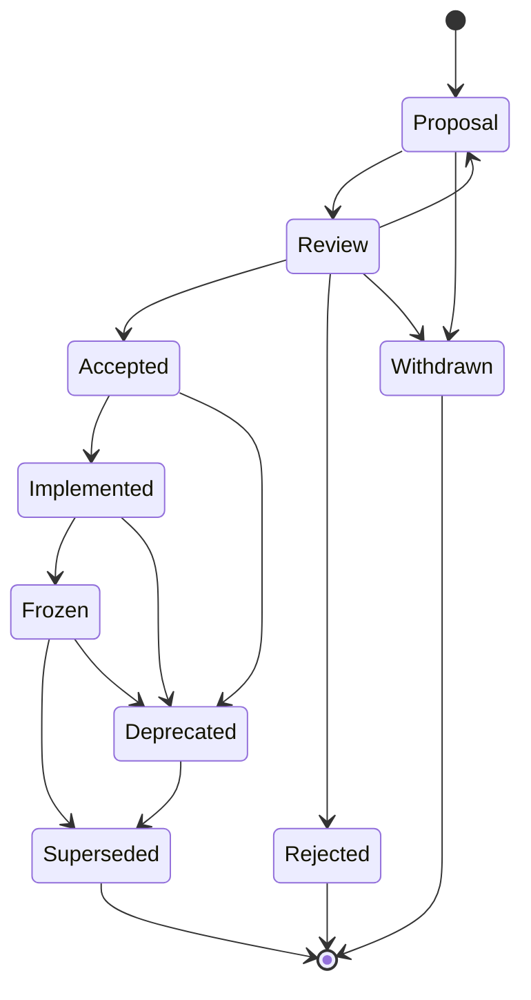

# OpenProof RFC State Transition Model

This document defines allowed state transitions for OpenProof RFCs.

The model is aligned with the ecosystem RFC standard and adds the `Frozen` and
`Superseded` states needed for specification freeze discipline.

## State Diagram

## Transition Table

| From | To | Required Condition |
|------|----|--------------------|
| Proposal | Review | Draft is complete enough for standards review. |
| Proposal | Withdrawn | Author withdraws before decision. |
| Review | Proposal | Review identifies missing specification work. |
| Review | Accepted | Maintainer accepts the specification. |
| Review | Rejected | Maintainer rejects with rationale. |
| Review | Withdrawn | Author withdraws during review. |
| Accepted | Implemented | A conforming OpenProof implementation exists. |
| Accepted | Deprecated | Accepted behavior is no longer recommended before implementation. |
| Implemented | Frozen | Specification has no unresolved normative questions and is publication-stable. |
| Implemented | Deprecated | Implementation experience shows the specification should not be recommended. |
| Frozen | Superseded | A newer RFC replaces the normative behavior. |
| Frozen | Deprecated | The specification remains historical but should not be used for new artifacts. |
| Deprecated | Superseded | A newer RFC provides a replacement. |

## Invalid Transitions

The following transitions are invalid:

- Rejected to Accepted without a new RFC.
- Withdrawn to Accepted without re-entering Proposal.
- Frozen to Proposal.
- Superseded to Accepted.
- Deprecated to Frozen without review.

## Terminal States

Rejected, Withdrawn, and Superseded are terminal for the affected RFC version.
Deprecated is not terminal because a deprecated RFC may later be superseded.
